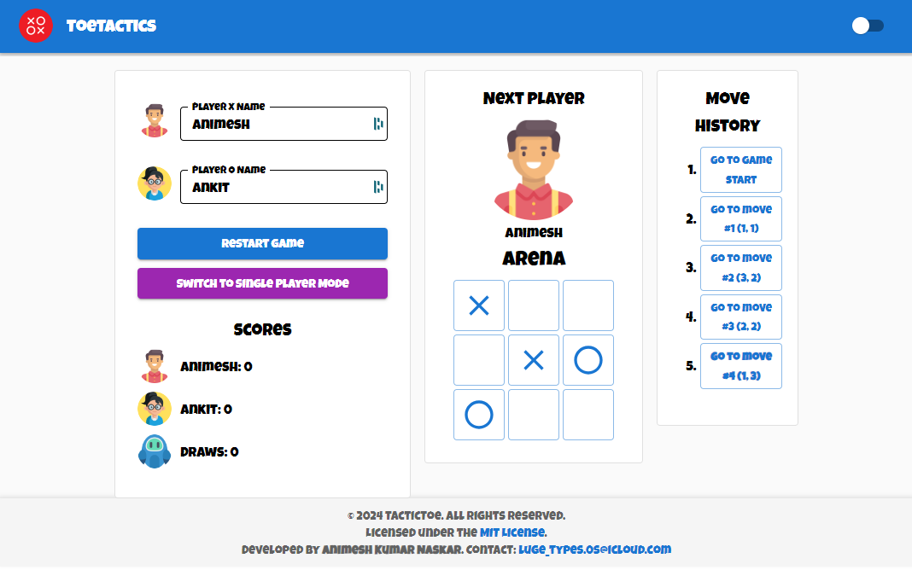

# TacticToe - A Fun Tic Tac Toe Game Built with React


## Table of Contents

- [About the Project](#about-the-project)
- [Built With](#built-with)
- [Features](#features)
- [Installation](#installation)
- [Usage](#usage)
- [Project Structure](#project-structure)
- [Author](#author)
- [License](#license)

---

## About the Project

TacticToe is a modern, responsive Tic Tac Toe game built with **React** and **Material-UI**. The game includes both single-player (AI-powered) and multiplayer modes, player avatars, and a dynamic user interface that supports light and dark themes.

 <!-- Add a screenshot of the app -->

---

## Built With

This project was built using the following technologies:

- [React](https://reactjs.org/)
- [Material-UI](https://mui.com/)
- [useSound](https://www.npmjs.com/package/use-sound) (for sound effects)

---

## Features

- **Single Player**: Play against an AI opponent.
- **Multiplayer**: Play with a friend locally.
- **Player Avatars**: Upload and display custom player avatars.
- **Light & Dark Modes**: Switch between light and dark themes.
- **Responsive Design**: Works across devices and screen sizes.
- **Sound Effects**: Enjoy sound feedback on clicks and game outcomes.

---

## Installation

Follow these steps to set up the project locally:

1. **Clone the Repository**:

   ```bash
   git clone https://github.com/animesh303/tactictoe.git
   cd tactictoe
   ```

2. **Install Dependencies**:

   Run the following command to install all required dependencies:

   ```bash
   npm install
   ```

3. **Start the Development Server**:

   Run the following command to start the app in development mode:

   ```bash
   npm start
   ```

   The app should open automatically in your default browser at `http://localhost:3000/`.

---

## Usage

### Playing the Game

- **Single Player Mode**: Start a game against an AI opponent.
- **Multiplayer Mode**: Play with a friend by manually switching turns.
- **Custom Avatars**: Click on the player avatar to upload a custom image.
- **Theming**: Toggle between light and dark modes via the theme switch.
- **Player Name**: Provide the name of the players.

### **TacticToe Rules**

1. **Objective**: The goal of the game is to be the first player to get three of your marks (either "X" or "O") in a row – horizontally, vertically, or diagonally.

2. **How to Play**:
   - The game is played on a 3x3 grid.
   - Players take turns placing their marks (X or O) in an empty square.
   - The first player is always "X", and the second player is "O".

3. **Winning the Game**:
   - The game is won by the first player to align three of their marks in a row, column, or diagonal.

4. **Draw**:
   - If all nine squares are filled and no player has achieved three in a row, the game ends in a draw.

5. **Turn-Based**:
   - In multiplayer mode, players take turns to place their marks.
   - In single-player mode, you play as "X" against an AI opponent who plays as "O".

### Changing the Font

If you want to change the font, simply edit the `themes.js` file and customize the `typography` section.

---

## Project Structure

```bash
.
├── public              # Public assets
├── src
│   ├── assets          # App icons, images
│   ├── sounds          # Audio clips
│   ├── pages           # Page-level components (About, Game, etc.)
│   ├── themes.js       # Custom Material-UI theme (light and dark modes)
│   ├── Game.js         # Game Main Component
│   ├── index.js        # Entry point of the app
│   ├── Board.js        # Game Board component
│   ├── Square.js       # Game Square component
│   └── ...
├── package.json        # Project metadata and dependencies
└── README.md           # Project documentation (this file)
```

---

## Author

This project was developed by **Animesh Kumar Naskar**. I'm a software developer specializing in building modern web applications. Feel free to reach out to me for any inquiries or feedback.

- GitHub: [Animesh Kumar Naskar](https://github.com/animesh303)
- Email: [luge_types.0s@icloud.com](mailto:luge_types.0s@icloud.com)

---

## License

This project is licensed under the MIT License. See the [LICENSE](https://opensource.org/licenses/MIT) file for more details.

---

## Contributing

Contributions are welcome! Please fork the repository, make your changes, and submit a pull request.

---

## Acknowledgements

- **Material-UI** for the design components.
- **useSound** for the audio integration.
- **React Router** for easy page navigation.

---
